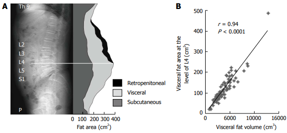
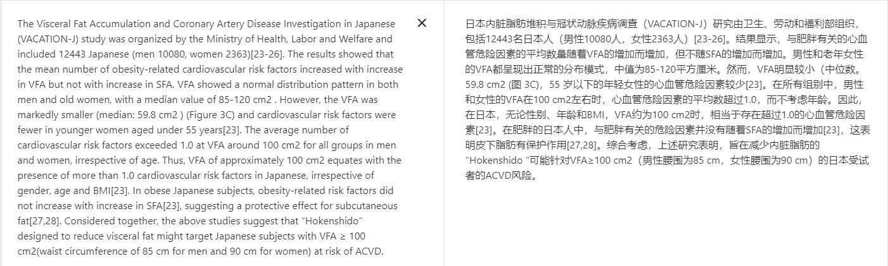
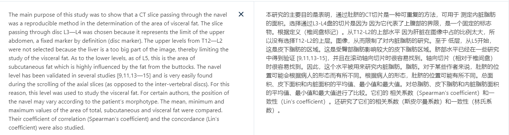
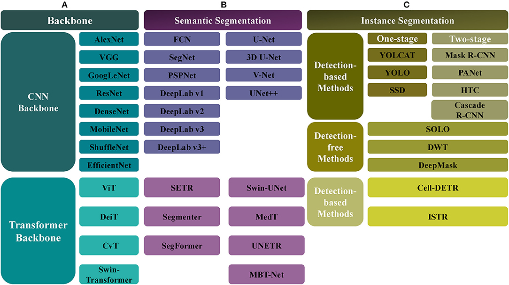
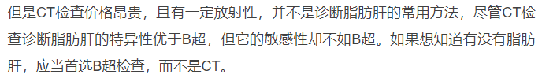
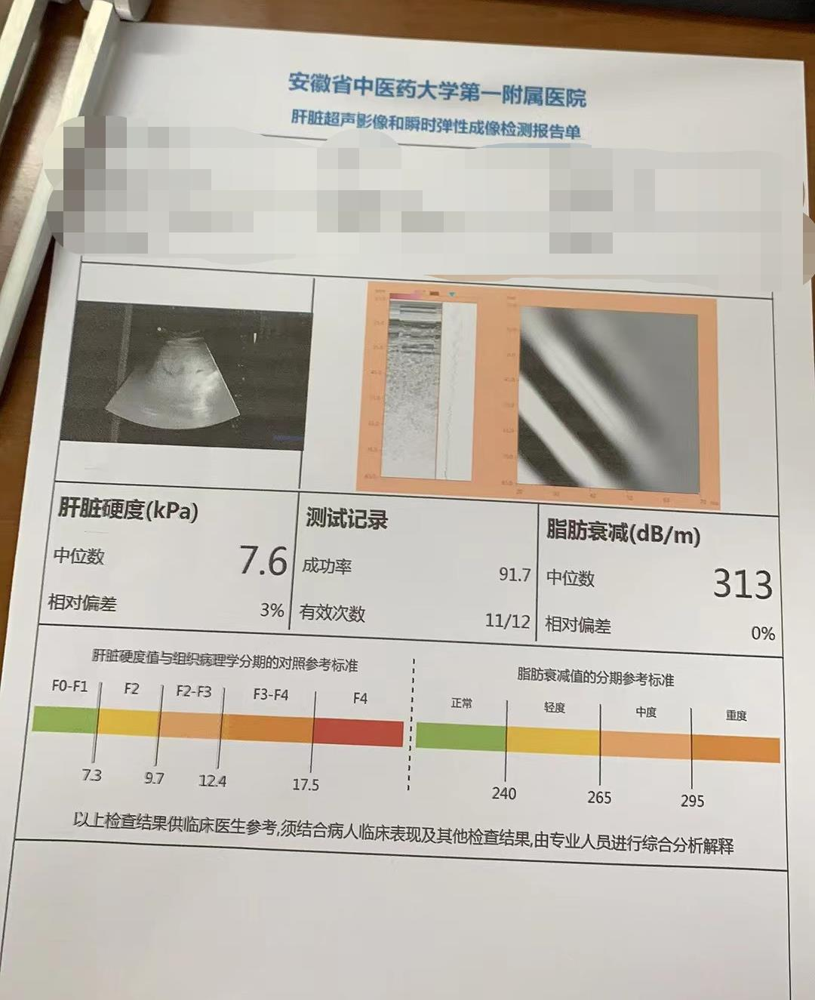
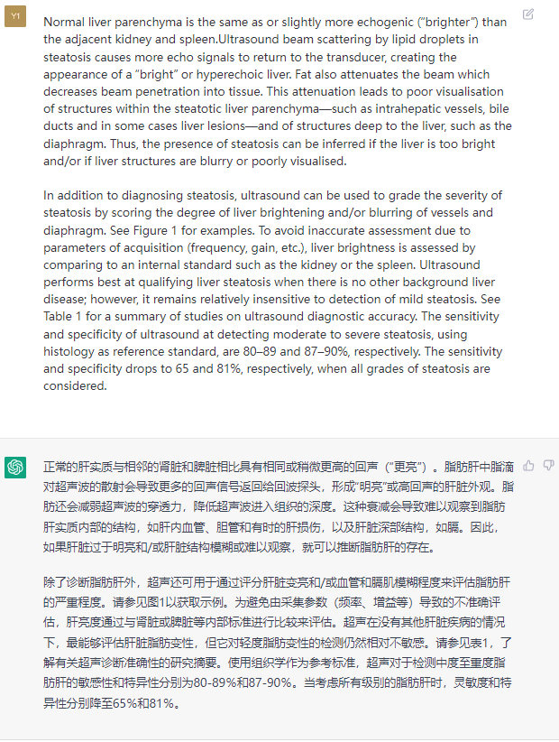
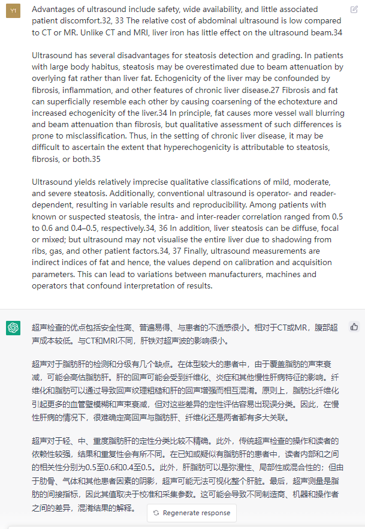
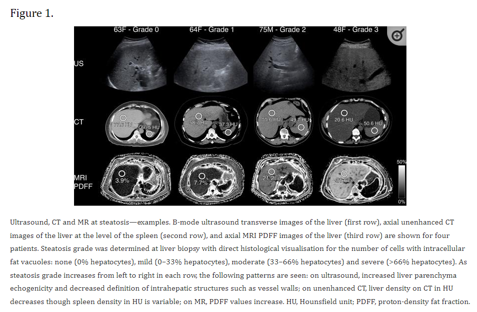
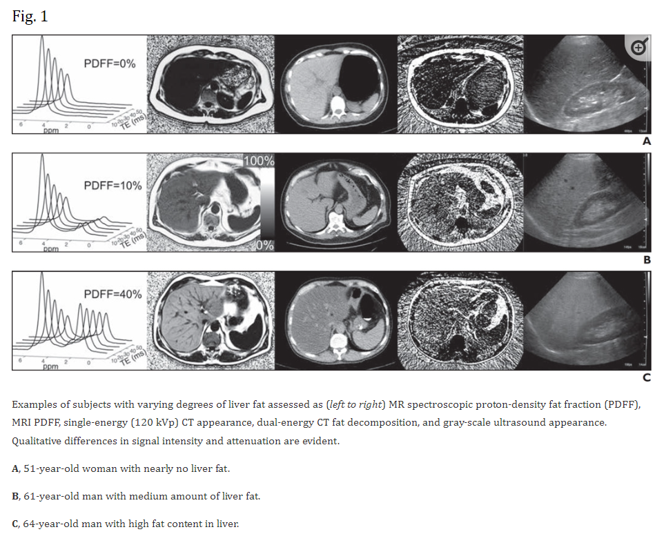

# 文献调研任务
- 2023.03.21
- @Frank-LSY
---
## 肺、肾、肝等肿瘤的CT影像，辨别基因型/细胞型
- 肝癌:
  - 肝细胞癌(Hepatocellular carcinoma, 85%)、胆管癌(Cholangiocarcinoma, 12%)、血管肉瘤(angiosarcoma, 1%)、肝母细胞瘤(hepatoblastoma, 儿童)
  - arterial phase:
    - definition: In LI-RADS, the arterial phase refers to the hepatic arterial phase unless otherwise specified. The arterial phase is a post-contrast injection time range in which images have the following characteristics:
      - Hepatic artery and branches are fully enhanced.
      - Hepatic veins not yet enhanced by antegrade flow.
    - comments:
      - Arterial phase imaging is required for both CT and MRI.
      - Hepatic arterial phase may be subclassified as early and late hepatic arterial phase.
        - Early hepatic arterial phase: portal vein is not yet enhanced.
        - Late hepatic arterial phase: portal vein is enhanced.
      - **Late hepatic arterial phase is strongly preferred for HCC diagnosis and staging, because the degree of enhancement in HCC usually is higher in the late than in the early hepatic arterial phase. Some HCCs may show hyper-enhancement only in the late hepatic arterial phase.**
  - 如果想通过CT识别，应该通过增强造影CT，普通CT识别率低，增强CT是否数量太少？
- 肾癌：
  - 透明细胞癌(Renal cell carcinoma, 70%-85%)、乳头状肾细胞癌或称为嗜色细胞癌(papillary renal cell carcinoma, 7%-14%)、嫌色细胞癌(Chromophobe Renal Cell Carcinoma, 4%- 10%)、集合管癌(Renal Collecting Duct Carcinoma)、未分类肾细胞癌
- 肺癌：
  - 小细胞肺癌(SCLC, 15%)、鳞状细胞癌(SCC, 25%-30%)、腺癌(40%)、大细胞癌(10%-15%)
  - 检查方法：胸部X光、胸部CT、支气管镜、痰细胞学

- 辨别基因，细胞型是指什么？是什么样的基因突变驱动了不同种类的癌症发生吗？
  - 路径是这样的吗？判断癌症种类，同时结合基因筛查，确定基因突变位点，相应地构建一个网络化的对应关系，判断哪些基因突变是决定性的。
  - 那么为什么要用到影像学信息？活检的结果可以更准确的表明是何种癌症分型。
  - [Understanding Genotype-Phenotype Effects in Cancer via Network Approaches](https://www.ncbi.nlm.nih.gov/pmc/articles/PMC4786343/) 回顾了通过构建网络来将癌症基因型和表型联结的综述。
---
---

## 腹部CT影像，计算内脏脂肪/皮下脂肪 (VAT/SAT auto segmentation and calculation)
- 上腹部CT/全腹CT
- [Clinical significance of visceral adiposity assessed by computed tomography: A Japanese perspective](https://www.ncbi.nlm.nih.gov/pmc/articles/PMC4109092/pdf/WJR-6-409.pdf)
  - 利用腰椎界面图(L2、L3、L4、L5、S1)重构fat area。
  - 腰4的CT平扫的内脏脂肪与总体内脏脂肪有很强的正相关性
  - 
  - VFA (Visceral Fat Accumulation) / SFA (Subcutaneous Fat Accumulation)
  - 直接利用腰4的CT平扫来计算相应VFA/SFA的面积
  - VFA/SFA临界值、腰围临界值
  
  ACVD(arteriosclerotic cardiovascular disease) 动脉硬化性心血管疾病
- [Quantification of the visceral and subcutaneous fat by computed tomography: Interobserver correlation of a single slice technique.](./pdf/sottier2013.pdf)
  - 采用哪些CT平扫图作为材料？
  
- [github.com/striver6/VAT-SAT](https://github.com/striver6/VAT-SAT)
  - [README](./pdf/README.pdf) 中提到了一些CNN方法。
- [Deep Learning for Automatic Image Segmentation in Stomatology and Its Clinical Application](https://www.frontiersin.org/articles/10.3389/fmedt.2021.767836/full)中提到了关于auto segmentation的算法。
  
  - 个人更倾向于使用 transfomer based models。更新，更热门，有话题。
  - Medical Transformer: [文章](https://arxiv.org/pdf/2102.10662.pdf)|[代码](htFtps://github.com/jeya-maria-jose/Medical-Transformer)
  - UNeXt: [文章](https://arxiv.org/pdf/2203.04967.pdf)|[代码](https://github.com/jeya-maria-jose/UNeXt-pytorch)
  - TransFuse: [文章](https://arxiv.org/pdf/2102.08005.pdf)|[代码](https://github.com/Rayicer/TransFuse)
  - TransUNet: [文章](https://arxiv.org/pdf/2102.04306.pdf)|[代码](https://github.com/Beckschen/TransUNet)
  - SwinUnet: [文章](https://arxiv.org/pdf/2105.05537.pdf)|[代码](https://github.com/HuCaoFighting/Swin-Unet)
  - SegFormer: [文章](https://arxiv.org/pdf/2105.15203.pdf)|[代码](https://github.com/NVlabs/SegFormer)
  - Segmenter: [文章](https://arxiv.org/pdf/2105.05633.pdf)|[代码](https://github.com/rstrudel/segmenter) 
  - [SETR](https://fudan-zvg.github.io/SETR/): [文章](https://arxiv.org/pdf/2012.15840.pdf)|[代码](https://github.com/fudan-zvg/SETR)
- [An Effective CNN Method for Fully Automated Segmenting Subcutaneous and Visceral Adipose Tissue on CT Scans](./pdf/Wang2019.pdf)
- [Artificial intelligence and abdominal adipose tissue analysis: a literature review](https://qims.amegroups.com/article/view/73355/pdf)
- [FatSegNet](https://onlinelibrary.wiley.com/doi/full/10.1002/mrm.28022)
- **流程: 上腹部或全腹部CT图像(① 易获得; ② 躺着拍清晰稳定; ③ 有强正相关性) -> 深度学习分割方法 -> 计算分割后面积 -> 计算VAT/SAT -> 通过比值等给出临床意义**

---
---

## 脂肪肝，CT影像学的判断算法
- 上腹部CT/全腹CT
- 为什么要影像识别脂肪肝？亦或是肝纤维化水平？临床意义或者是其他？
- 
### 一些问题
- 什么样的脂肪肝？非酒精性脂肪肝 -- 非酒精性脂肪性肝炎
- NAFLD (nonalcoholic fatty liver disease)
- NASH (nonalcoholic steatohepatitis)
- CT or B超？B超在临床检查中使用更为广泛。常规体检很少用到CT甚至MRI来检测肝脏状态。需要做CT检查的病人通常肝脏已经有较明显的问题，因此拿到的数据集很有可能具有较大的bias。
- 市面上已有[肝纤维化分析仪](https://www.hiskymedical.com/list_2/6.html)，双探头，一个是普通B超图像采集，一个是检测脂肪层和肝脏弹性度。[简介](./pdf/%E6%82%A3%E6%95%99%E6%98%93%E6%8B%89%E5%AE%9D.pdf)

如果单纯只考虑B超图像，放射科医生是从B超图像中首先判断出肝和肾，然后根据肝、肾区域的明暗对比来判断脂肪肝等级。
- [一篇关于脂肪肝影像进展的综述](https://www.ncbi.nlm.nih.gov/pmc/articles/PMC6223150/pdf/bjr.20170959.pdf)
  - 
  - 
  - 
- [Accuracy of Liver Fat Quantification With Advanced CT, MRI, and Ultrasound Techniques: Prospective Comparison With MR Spectroscopy](https://www.ncbi.nlm.nih.gov/pmc/articles/PMC5204456/pdf/nihms837840.pdf)
  - 
---
---
### 数据集
- [LiTS17](https://competitions.codalab.org/competitions/17094) | 肝癌分割
- [KiTS21](https://github.com/neheller/kits21) | 肾分割
- [NIH-Pancreas CT](https://wiki.cancerimagingarchive.net/display/Public/Pancreas-CT) | 腹部CT
- [MDC](http://medicaldecathlon.com/) | [10 tasks: 脑癌、心脏、肝癌、海马体、前列腺、肺、胰腺、肝脏血管、脾脏、结肠](http://medicaldecathlon.com/)
- [AbdomenCT-1K](https://github.com/JunMa11/AbdomenCT-1K) | 腹部CT [with a paper](https://arxiv.org/pdf/2010.14808.pdf)

---
---
### 其他
- [Microsoft 和 OpenAI 在医学任务上测试 GPT-4](https://www.microsoft.com/en-us/research/uploads/prod/2023/03/GPT-4_medical_benchmarks.pdf)
- 总体来说，无论哪个任务，image segmentation的相关技术都是需要关注的。
- 如果要用transformer，如何将图像编码为序列比较关键。特别是位置信息的提取。
- 方法导向 or 应用导向？
  - 方法导向，构建一个通用的，可调优、可复用的CT图像分割AI框架。后续可以加上相关的EHR数据，组建一个大模型，进行多模态分析等。
  - 应用导向，运用现有技术，依照以上提出的3个问题，提出临床问题，仅运用现有AI方法并适当调优尝试解决问题，并在临床中尝试应用。

