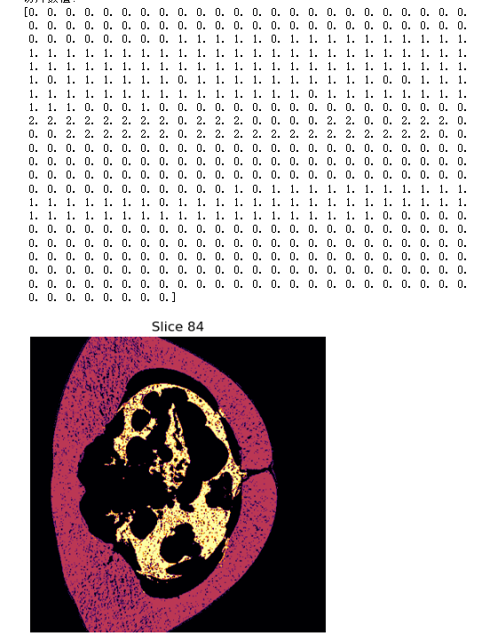

| 时间   | 文章                                                                                                                                                                                                                    | 概述                                                                                                                     | 效果                                                                                                                                                                                                                                                                           |
| ------ | ----------------------------------------------------------------------------------------------------------------------------------------------------------------------------------------------------------------------- | ------------------------------------------------------------------------------------------------------------------------ | ------------------------------------------------------------------------------------------------------------------------------------------------------------------------------------------------------------------------------------------------------------------------------ |
|        | **关于分割方法**                                                                                                                                                                                                        |                                                                                                                          |                                                                                                                                                                                                                                                                                |
| 2022.9 | [Deep learning for abdominal adipose tissue segmentation with few labelled samples](https://pubmed.ncbi.nlm.nih.gov/35995029/)                                                                                          | CNN+少量标注样本+迁移学习                                                                                                | no full text                                                                                                                                                                                                                                                                   |
| 2023.2 | [A Combined Region- and Pixel-Based Deep Learning Approach for Quantifying Abdominal Adipose Tissue in Adolescents Using Dixon Magnetic Resonance Imaging](./pdf/tomography-09-00012.pdf)       | nothing special   CNN+U-Net 监督学习   用的MRI数据，不是我们要的                                                                                 | 准确率 97%以上                                                                                                                                                                                                                                                                 |
| 2022.7 | [URO-GAN: An untrustworthy region optimization approach for adipose tissue segmentation based on adversarial learning](./pdf/URO-GAN_An_untrustworthy_region_optimization_appro.pdf)                                    | 对抗学习 & 半监督   SAT 向 VAT 迁移   84 标注+3969 无标注样本   (_无代码_)                                      | 准确率 95%左右                                                                                                                                                                                                                                                                 |
| 2022.4 | [Hybrid convolutional neural network based segmentation of visceral and subcutaneous adipose tissue from abdominal magnetic resonance images](./pdf/Hybrid_convolutional_neural_network_based_segmenta.pdf)             | CNN   混合了中间层 & 改进反向传播   监督学习                                                                       | 准确率 97%以上                                                                                                                                                                                                                                                                 |
| 2023.2 | [MultiRes Attention Deep Learning Approach for Abdominal Fat Compartment Segmentation and Quantification](./pdf/MultiRes_Attention_Deep_Learning_Approach_for_Abdo.pdf)                                                 | U-Net 的单元改成多层注意力机制的 multihead res   监督学习                                                             | 准确率 98%以上                                                                                                                                                                                                                                                                 |
| 2020.12 | [nnU-Net: Self-adapting Framework for U-Net-Based Medical Image Segmentation](https://www.nature.com/articles/s41592-020-01008-z)                                                 | no-new Unet，代码完善   监督学习                                                             | 通常都有不错的效果                                                                                                                                                                                                                                                                 |
|        | **关于疾病关联方向**                                                                                                                                                                                                    |                                                                                                                          |                                                                                                                                                                                                                                                                                |
| 2023.1 | [Gender-specific data-driven adiposity subtypes using deep-learning-based abdominal CT segmentation](./pdf/Obesity-2023-Zou-GenderspecificdatadrivenadipositysubtypesusingdeeplearningbasedabdominalCTsegmentation.pdf) | 用了T12-S1的切片来分割，方法来自: [cross-stage-attention + 对抗方法(2022.1)](https://www.sciencedirect.com/science/article/abs/pii/S1746809421007692) 量化腹部肥胖并生成具有不同糖尿病风险的数据驱动的肥胖亚型   使用皮下脂肪、内脏脂肪、肝脏脂肪和肌肉脂肪的比例来识别亚组 | 三个性别特异的腹部肥胖亚组: 内脏脂肪显性型 (VFD)、皮下脂肪显性型 (SFD) 、肌肉间脂肪显性型 (MFD)。  VFD 组，男性糖尿病风险高 60％。  经调整的 MFD 组的糖尿病优势比为 1.92。 VFD 组，女性的糖尿病赔率为 6.14。  这些发现可能有助于临床医生快速自动地区分糖尿病风险。 |

区域投票法则？

如何利用3D slicer 的半自动方法分割脂肪？ (*total time: 15min per CT*)
   1.  threshold方法，依据不同HU分出属于脂肪的区域，作为基本mask (*1min*)
   2.  painting 方法， 画出 大致vat sat seeds (*5 min*)
   3.  grow from seeds (*1min-2min, depending on PC performance*)
   4.  检查，并进行相应调整修改 (*5min*)
   5.  查看分割后的vat sat 体积，并计算比值，记录 (*1min*)
   6.  保存带label的CT (nii.gz格式) (*1 min*)

本周任务:
   1. 利用3D slicer软件从一张CT中标注出VAT和SAT部分
   2. 将分割出的VAT、SAT体积记录在如下格式的csv文件中:

   |vat体积(cm3)|sat体积(cm3)|vat/sat比值 (%)|
   |----|----|----|
   |2600|8000|32.50%|
   3. 利用python代码，读取3D slicer标记好的CT，并展示某一切片的图像，以及该切片某一行或一列的label值
   
        

    如例图，展示了CT图像第84层中具体一行的label数值，以及label的图像化展示。其中0代表非标记区域，1代表皮下脂肪区域(SAT，红色)，2代表内脏脂肪区域(VAT，黄色)
    4. 看文献，找方法，半监督/无监督分割脂肪的算法(GAN模型或VAE模型为主)(孙、郎)
    5. 看文献，找方法，成熟的有监督分割脂肪的算法，最好有现成代码实现(Unet及相关架构)(贾)
    6. 看文献，找找腹部脂肪与慢性病(高血压、脂肪肝、肾病等)关联性的相关研究，注意除了腹部CT，还需要收集处理哪些数据